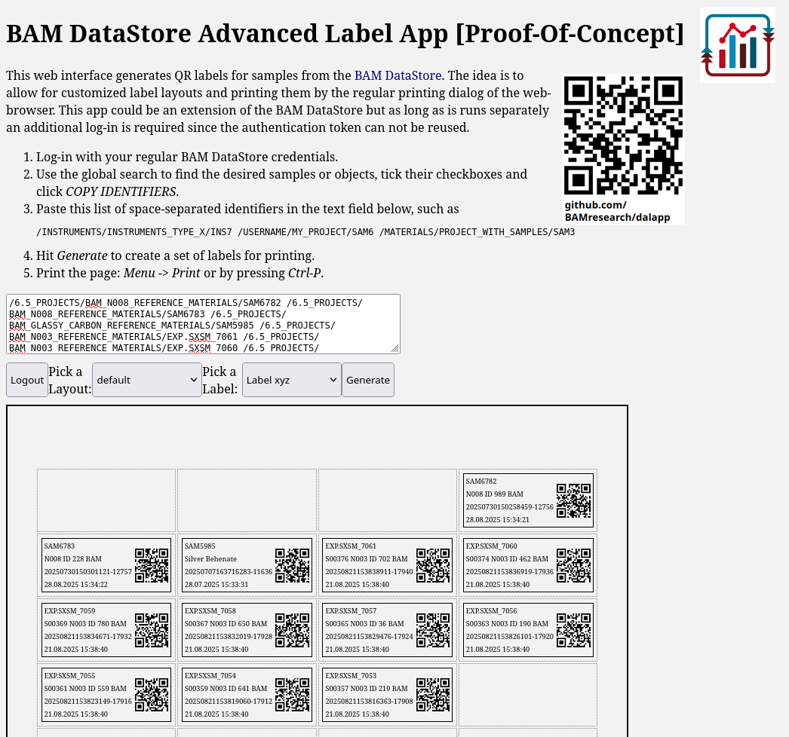

# DataStore Advanced Label App (Proof-Of-Concept)

Work in progress ;) This shall be, one day: 

- A web interface (or DataStore extension) for batch generation of labels with QR codes for samples
- Extend QR code generation by additional info & formats (for tiny, normal and big bottles)
- Allow custom label layout, predefined layouts allow for standardization as well 
- Key features:
    - web interface, accessibility on each PC with DataStore access, no installation of anything
    - Generate standard A4 PDF files to be printed on regular network printers anywhere, no special hardware or drivers
    - Allow to predefine label grids for widely used label sheets, e.g. Herma
    - Select multiple sample objects quickly, e.g. in a DataStore listing
    - Technical thoughts:
        - Javascript should be suitable for this, as it can be used by any employee in the webbrowser and requires no additional hardware or setup.

[There is a short presentation about this app held on the OpenBIS User Group Meeting 2025 at BAM.](docs/250923%20Datastore%20Advanced%20Label%20App%20Demo%20-%20OpenBIS%20UGM%202025.pdf)

## Usage

In each of the cases documented below, run or isntall the app like this:

    python installOrProxy.py config.json

### A. Install to OpenBIS

This uploads the App (self-contained HTML with Javascript and images embedded) to your OpenBIS instance as configured in `config.json` with `uploadNoProxy: true`.

### B. Host the app on you separate web server

This needs to run the proxy app to allow you to authenticate against the OpenBIS server and use its API. For this, set `uploadNoProxy: false` in `config.json`.

## Feedback & Collaboration

Please use the [Issues Section](https://github.com/BAMresearch/dalapp/issues) for feedback and problems.
This is very open for collaboration, please consider submitting [a pull request](https://github.com/BAMresearch/dalapp/pulls) :)

## Current State Screenshot

